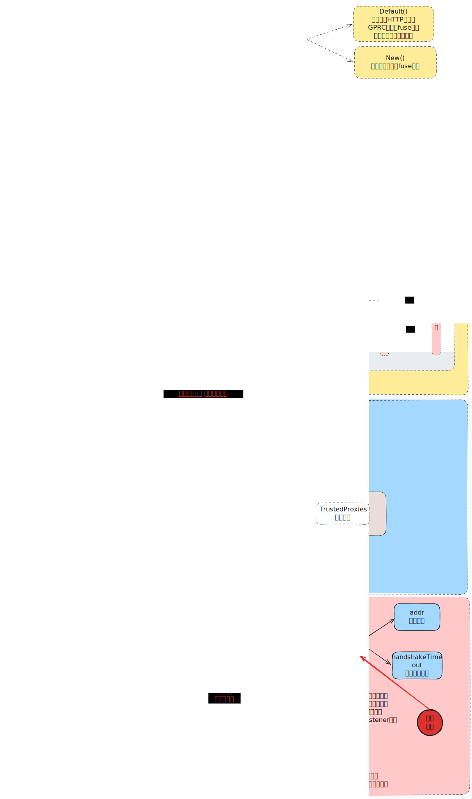

# Fuse

[English](README.md) | [简体中文](README-zh.md)

**A lightweight, protocol-agnostic Go server framework skeleton**


Fuse aims to provide a unified server-side development experience. Through a highly abstracted Context + Middleware model, it normalizes the processing flow of multiple protocols such as HTTP, gRPC, Cron, WebSocket, and SSE, allowing developers to build services with a consistent paradigm.

The codebase currently adopts a Core + Facade architecture pattern. The `fuse` package serves as a unified entry point, hiding the complexity of underlying dependencies.



## Core Design: Unified Abstraction

The core philosophy of Fuse is to define a set of universal interface standards, around which all specific protocol implementations are built.

*   **Abstract Contract (Core)**: Defines the most fundamental interfaces of the framework (such as Ctx, Result). All protocol adapters (httpx, wsx, etc.) depend on this, ensuring clear architectural layering and no interference between protocols.
*   **Unified Facade**: Users only need to focus on the API provided by the `fuse` package, without worrying about the underlying implementation or complex dependencies.

This design keeps internal components loosely coupled while providing users with a simple and consistent development experience.

## Protocol Support

Fuse supports running multiple protocols on a single port via connection multiplexing (CMUX) technology. For detailed protocol implementations, please refer to [Protocol Documentation](./docs/protocols.md).

*   **HTTP/1.1**: Built-in high-performance router, supports RESTful APIs.
*   **HTTP/2 (gRPC)**: Seamless RPC support, coexists with HTTP services.
*   **WebSocket**: Provides upgrade handling, message pump, and heartbeat mechanism.
*   **SSE**: Supports Server-Sent Events push.
*   **Cron**: Integrated scheduled task engine.

## Directory Structure

```text
Fuse
+---core            # Core abstraction layer (Ctx, Result)
+---cronx           # Cron task adapter
+---docs            # Documentation
+---fuse            # Unified user entry (Facade)
+---grpcx           # gRPC protocol adapter
+---httpx           # HTTP protocol adapter
+---middleware      # Common middleware collection
+---mux             # Protocol multiplexer (CMUX)
+---ssex            # SSE protocol adapter
\---wsx             # WebSocket protocol adapter
```

## Quick Start

### Installation

```bash
go get github.com/xianbo-deep/Fuse
```

### Example Code

```go
package main

import "github.com/xianbo-deep/Fuse/fuse"

func main() {
    // 1. Initialize engine
    app := fuse.New()

    // 2. Register routes (using fuse.Context)
    app.HTTP().Get("/ping", func(c fuse.Context) fuse.Result {
        return c.Success(fuse.H{"message": "pong"})
    })

    // 3. Start server
    if err := app.Run(":8080"); err != nil {
        panic(err)
    }
}
```

## Roadmap

- [x] Complete gRPC protocol support
- [x] Optimize middleware chain memory allocation
- [x] Implement graceful shutdown
- [x] WebSocket protocol adapter (wsx) and heartbeat detection
- [x] HTTP route priority control and Radix Tree implementation
- [x] HTTP route grouping
- [x] SSE protocol adapter (ssex) and Keep-Alive
- [x] Single-port protocol dispatch (CMUX)
- [x] WebSocket message pump
- [ ] CMUX protocol tree implementation
- [x] CMUX dynamic protocol registration
- [x] Add more common middleware (Limit, Trace)
- [x] WebSocket JSON parsing
- [x] HTTP parameter validation (Validator)
- [ ] Improve unit tests and Benchmarks comparison
- [x] Improve GoDoc
- [ ] Supplement related documentation

For more detailed design and usage, please read the documents in the [docs](./docs) directory.
